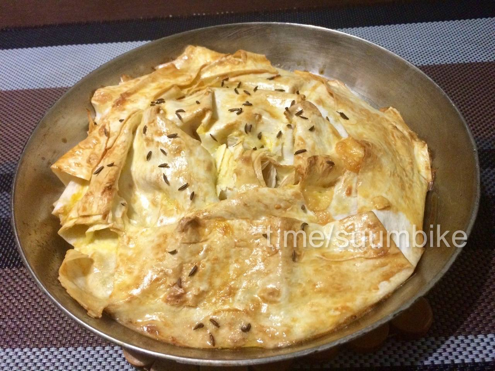
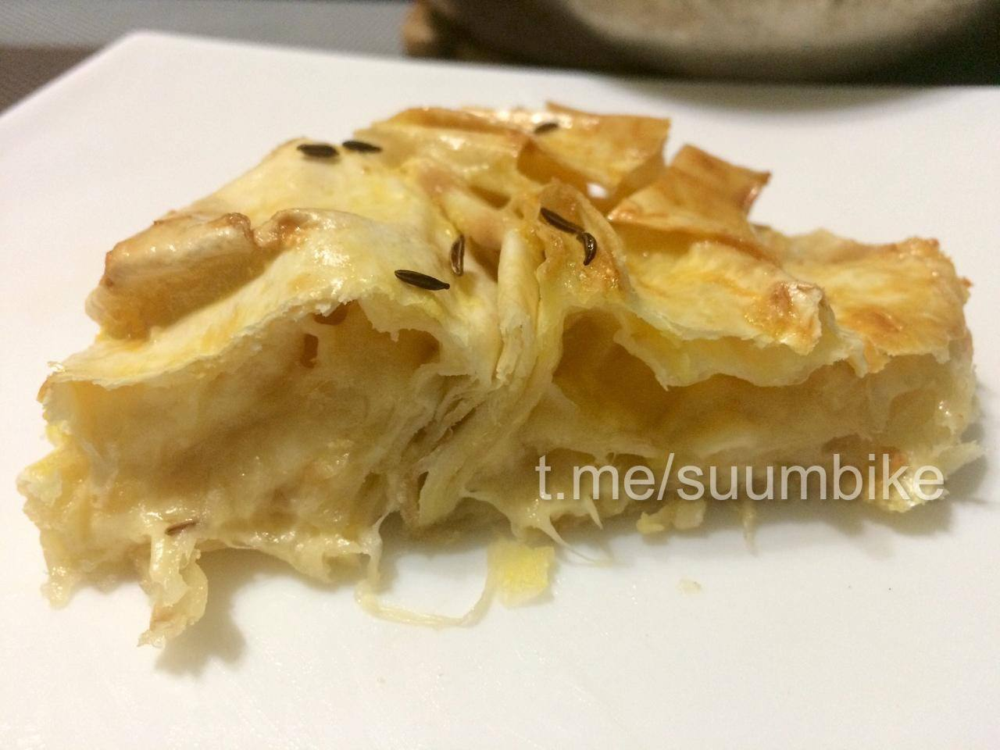

# Рус

# Ачма

{ width="300" }
{ width="300" }
{ width="300" }

## Состав 

* 200 г лаваша (рулета);
* 200 г сыра;
* 100 мл молока;
* 1 яйцо;
* 50-70 г сливочного масла;
* одна щепотка семян аниса.

## Ход работы

1. Смажьте верх питы молоком и оставьте на 2–3 минуты, чтобы оно размягчилось. Пита не должна быть черствой. Удобнее использовать большой прямоугольный рулет из лаваша, а не круглый.
2. Натрите сыр на крупной терке и равномерно распределите по пите.
3. Затем сворачиваем в рулет.
4. Смажьте форму маслом и выложите рулет в форме спирали. Смажьте верх лаваша щедро взбитым яйцом и разложите сверху небольшие кусочки масла.
5. Мы всё еще сеем семена аниса.Семена кунжута тоже подойдут.
6. Поставьте в разогретую до 170-175 градусов духовку на 40 минут. Он должен стать розовым.

!!! note "Рекомендация"
    Блюдо подаётся тёплым. Его можно подавать с чаем, соусом или даже легким салатом.

Наслаждайтесь!

