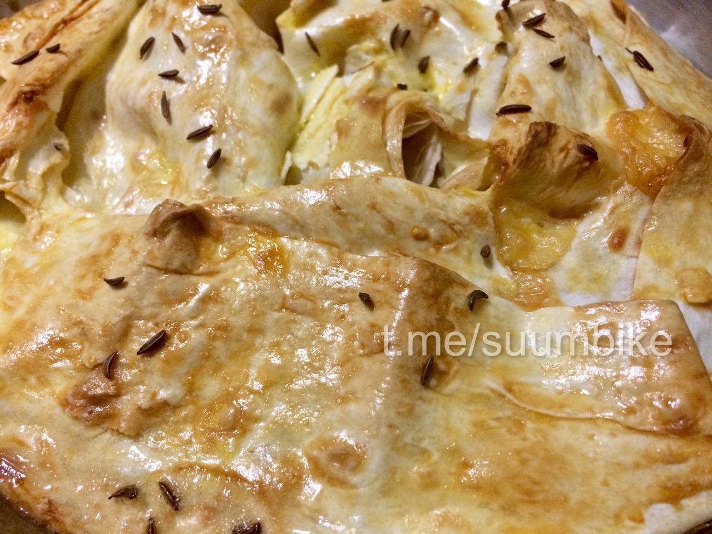

# Ачма (на татарском)

Үзенә күрә бу гади генә ризык, ә менә нәтиҗәсе бик тә үзенчәлекле. Сулугуни дигән сыр куллансаң, отышлырак булачак.

# Галерея

{ width="300" }
{ width="300" }
{ width="300" }

## Кушылма 

| №   | Ингредиент   | Мәгънәсе | Үлчәү берлеге |
| --- | :----------- | :------- | :------------ |
| 1   | ләвәш (ролл) | 200      | г             |
| 2   | сыр          | 200      | г             |
| 3   | сөт          | 100      | мл            |
| 4   | йомырка      | 1        | шт            |
| 5   | сары май     | 50-70    | г             |
| 6   | әнис орлыгы  | 1        | чеметем       |

## Эш барышы

1. Ләвәшнең өстен сөт белән сөртеп, йомшасын өчен аны 2-3 мин калдырабыз. Ләвәшнең искермәгән булырга тиеш. Түгәрәк ләвәш түгел, ә ролл ләвәшен – зур дүртпочмаклысы уңайлырак.
2. Сыр эре угычтан уыла һәм тигез итеп ләвәш өстенә таратыла. 
3. Аннары рулет формасында төрелә.
4. Табаны сары май белән майлап, рулетны табага спираль формасында урнаштырабыз. Өстен күперткән йомырка белән мул итеп майлап, кечкенә кисәкләр килеш ләвәш өстенә сары май тезеп чыгабыз. 
5. Әле тагын әнис орлыклары сибәбез. Кунжут орлыгы булса да ярый.
6. 170-175 градуска кадәр кызган духовкага 40 минутка куябыз. Ул алсу төскә керергә тиеш. 

!!! note "Киңәш"

    Табынга ачма җылы килеш бирелә. Аны чәй белән дә, соус белән дә, җиңелчә генә салат белән дә чыгарырга мөмкин.

Тәмле булсын!

{ width="300" }