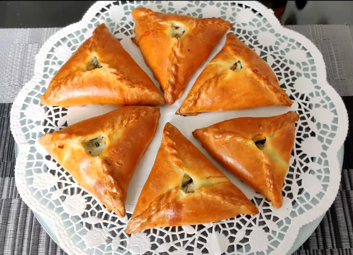

# Өчпочмак
Эчпочмак — одно из самых популярных национальных блюд Татарстана, без которого невозможно представить ни праздничного стола, ни повседневного рациона обычной среднестатистической семьи. Небольшой пирожок в форме треугольника с дырочкой посередине можно встретить в меню любого ресторана Казани, даже самого изысканного.

{ width="300" }